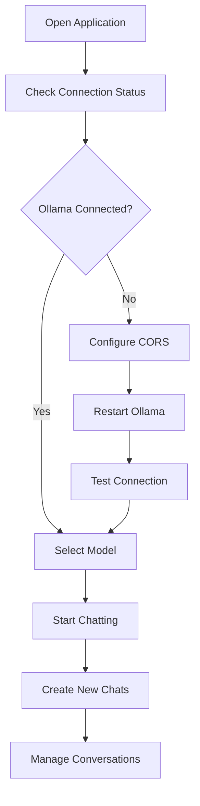
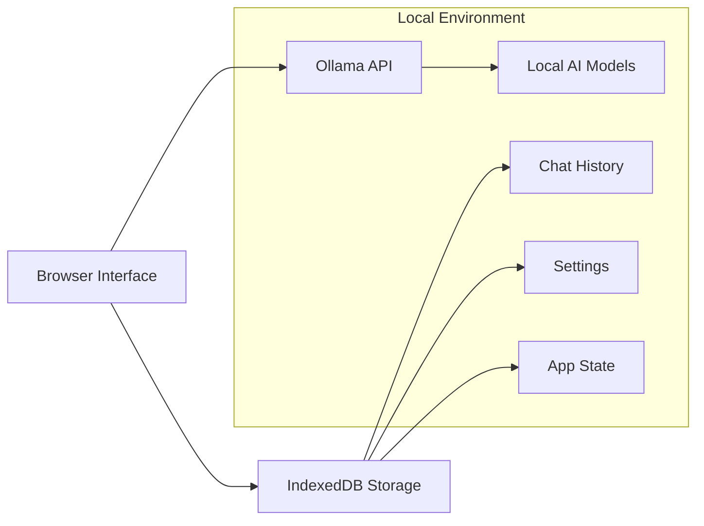

# xsukax Ollama WebUI Chat

A modern, privacy-focused web interface for interacting with Ollama AI models. This application provides a sleek, user-friendly chat interface that runs entirely in your browser while connecting directly to your local Ollama installation.

[](https://youtu.be/SAn-xqoVjGU)

### [Watch this video on YouTube](https://youtu.be/SAn-xqoVjGU)


## Project Overview

xsukax Ollama WebUI is a comprehensive web-based frontend for Ollama, designed to provide an intuitive chat experience with AI language models. The application offers a complete chat management system with real-time streaming responses, model management capabilities, and persistent conversation history—all while maintaining strict privacy standards through local-only operation.

Key capabilities include:
- **Interactive Chat Interface**: Real-time streaming conversations with AI models
- **Model Management**: Download, manage, and remove Ollama models directly from the interface  
- **Session Persistence**: Automatic saving and restoration of chat histories using browser storage
- **Multi-Chat Support**: Create and manage multiple conversation threads
- **Connection Diagnostics**: Built-in troubleshooting tools for Ollama connectivity
- **Responsive Design**: Optimized for both desktop and mobile devices

## Security and Privacy Benefits

This application prioritizes user privacy and data security through several key design principles:

### **Complete Local Operation**
- **Zero External Data Transmission**: All conversations remain on your local machine
- **No Cloud Dependencies**: No data is sent to external servers or third-party services
- **Direct Ollama Integration**: Communicates exclusively with your local Ollama installation

### **Browser-Based Storage Security**
- **IndexedDB Encryption**: Utilizes browser's built-in IndexedDB for secure local storage
- **No Server-Side Storage**: Chat histories are stored entirely within your browser
- **Automatic Data Isolation**: Each browser profile maintains separate, isolated data

### **Network Security**
- **CORS-Aware Design**: Includes comprehensive CORS configuration guidance
- **Local Network Only**: Designed to operate within your local network environment
- **Secure Connection Handling**: Validates and secures all API communications

### **Data Protection Features**
- **Ephemeral by Design**: Data exists only as long as you maintain it locally
- **User-Controlled Deletion**: Complete control over chat history and data removal
- **No Analytics or Tracking**: Zero telemetry or usage data collection

## Features and Advantages

### **User Experience Excellence**
- **Intuitive Interface**: Clean, modern design inspired by leading chat applications
- **Real-Time Streaming**: Live response streaming for immediate feedback
- **Smart Auto-Resize**: Adaptive input field that grows with your content
- **Mobile Responsive**: Fully functional on smartphones and tablets

### **Advanced Model Management**
- **One-Click Model Installation**: Download models directly through the interface
- **Progress Monitoring**: Real-time terminal output for model operations
- **Storage Awareness**: Visual feedback on model sizes and disk usage
- **Quick Model Switching**: Seamless switching between different AI models

### **Conversation Management**
- **Persistent Chat History**: Automatic saving of all conversations
- **Multi-Session Support**: Manage multiple conversations simultaneously
- **Smart Chat Previews**: Quick overview of conversation content
- **Conversation Search**: Find specific chats through intelligent organization

### **Technical Advantages**
- **Single File Deployment**: Complete application in one HTML file
- **No Installation Required**: Runs directly in any modern web browser
- **Lightweight Architecture**: Minimal resource usage and fast loading
- **Offline Capable**: Functions without internet connectivity

## Installation Instructions

### Prerequisites

1. **Ollama Installation**: Ensure Ollama is installed and running on your system
   - Download from: https://ollama.ai
   - Verify installation: `ollama --version`

2. **CORS Configuration**: Configure Ollama to allow browser connections

#### For Windows:
```cmd
# Temporary (for current session)
set OLLAMA_ORIGINS=* && ollama serve

# Permanent (requires restart)
setx OLLAMA_ORIGINS "*"
```

#### For macOS/Linux:
```bash
# Temporary (for current session)
OLLAMA_ORIGINS=* ollama serve

# Permanent (add to ~/.bashrc or ~/.zshrc)
export OLLAMA_ORIGINS="*"
```

### Application Setup

1. **Download the Application**:
   ```bash
   # Clone the repository
   git clone https://github.com/xsukax/xsukax-Ollama-WebUI-Chat-Frontend.git
   cd xsukax-Ollama-WebUI-Chat-Frontend
   ```

2. **Launch the Application**:
   - Open `index.html` in your web browser
   - Or serve via local web server:
   ```bash
   # Using Python
   python -m http.server 8080
   
   # Using Node.js
   npx serve .
   ```

3. **Verify Connection**:
   - The application will automatically attempt to connect to `http://localhost:11434`
   - Check the connection status indicator in the sidebar
   - Use the "Test Connection" button in Settings if needed

## Usage Guide

### Initial Setup Workflow



### Core Application Architecture



### Getting Started

1. **First Launch**:
   - Open the application in your browser
   - Check the connection indicator (top-left)
   - If disconnected, follow CORS setup instructions

2. **Model Management**:
   - Navigate to Settings → Model Management
   - Enter model name (e.g., `llama2`, `mistral`, `gemma3:1b`)
   - Click "Pull Model" to download
   - Monitor progress in the terminal output

3. **Starting Conversations**:
   - Select a model from the dropdown
   - Click "New Chat" to create a conversation
   - Type your message and press Enter or click send
   - Responses stream in real-time

### Advanced Features

#### Chat Management
- **Creating Chats**: Use "New Chat" button or start typing with a model selected
- **Switching Chats**: Click any chat in the sidebar to switch contexts
- **Deleting Chats**: Hover over chat and click the × button
- **Clearing History**: Use "Clear Chat" to remove all messages from current chat

#### Model Operations
- **Download Models**: Settings → Model Management → Enter model name → Pull Model
- **Remove Models**: Click "Remove" next to any installed model
- **Monitor Progress**: Terminal shows real-time download/removal progress

#### Settings Configuration
- **Ollama URL**: Change if Ollama runs on different port/host
- **Temperature**: Adjust response creativity (0.0 = focused, 1.0 = creative)
- **Top P**: Fine-tune response diversity (0.1 = focused, 0.9 = diverse)

### Troubleshooting Common Issues

#### Connection Problems
1. **CORS Error**: Follow CORS configuration steps above
2. **Port Issues**: Verify Ollama is running on port 11434
3. **Firewall**: Ensure local connections are allowed

#### Model Issues
1. **Download Failures**: Check internet connection and disk space
2. **Model Not Available**: Verify model name at [https://ollama.ai/library](https://ollama.ai/library)
3. **Performance Issues**: Consider using smaller models on limited hardware

#### Data Issues
1. **Lost Chats**: Check if using same browser profile
2. **Storage Limits**: Clear old chats if approaching browser storage limits
3. **Settings Reset**: Re-configure settings if browser data was cleared

## System Requirements

### Minimum Requirements
- **Browser**: Chrome 80+, Firefox 75+, Safari 13+, Edge 80+
- **RAM**: 4GB (depends on selected AI model)
- **Storage**: 2GB+ available (for model downloads)
- **Network**: Local network access to Ollama instance

### Recommended Specifications
- **Browser**: Latest version of Chrome, Firefox, or Edge
- **RAM**: 8GB+ (for larger models like Llama 70B)
- **Storage**: 10GB+ available (for multiple models)
- **CPU**: Multi-core processor for optimal model performance

## Contributing

We welcome contributions to improve xsukax Ollama WebUI. Please follow these guidelines:

1. **Fork the repository** and create a feature branch
2. **Test thoroughly** across different browsers and Ollama versions
3. **Maintain code quality** and follow existing styling patterns
4. **Document changes** in your pull request description
5. **Ensure security** by avoiding external dependencies where possible

## Licensing Information

This project is licensed under the **GNU General Public License v3.0 (GPL-3.0)**.

### What this means:

**For Users:**
- ✅ **Free to Use**: Use the software for any purpose without cost
- ✅ **Free to Modify**: Modify the source code to suit your needs
- ✅ **Free to Distribute**: Share the software with others
- ✅ **Access to Source**: Full source code is always available

**For Contributors:**
- 📋 **Share Improvements**: Any modifications must be shared under the same license
- 📋 **Preserve License**: Cannot change the licensing terms of the original work
- 📋 **Attribution Required**: Must maintain original copyright notices
- 📋 **No Warranty**: Software provided "as-is" without guarantees

**For Commercial Use:**
- ✅ **Commercial Use Allowed**: Can be used in commercial environments
- 📋 **GPL Compliance Required**: Any distributed modifications must remain GPL-3.0
- 📋 **Source Code Sharing**: If distributed, source code must be made available

The GPL-3.0 ensures this software remains free and open-source while encouraging community contributions and preventing proprietary lock-in.

## Support and Community

- **Issues**: Report bugs and feature requests via GitHub Issues
- **Discussions**: Join community discussions in GitHub Discussions
- **Updates**: Watch the repository for updates and new releases

---

**Built with privacy in mind. Powered by your local Ollama installation.**
